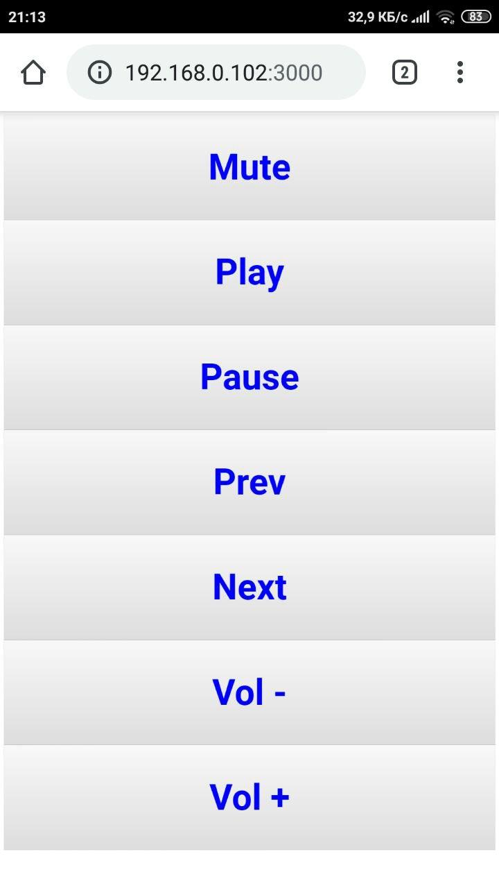

# Music remote controller

Made to control music on a computer from a smartphone.
PWA supported.

## start instructions:
- npm i
- npm run start
- Open http://**{computer_ip}**:3000/ in your browser

## Future plans:
0) [**Done**] Show local computer IP
1) Add password for connect to service
2) Use TypeScript
3) Move PORT to env
4) Add slider for music volume
5) Add websockets?
6) Vibration should be optional
7) Use service worker for caching?
8) [**Done**] Add icons for PWA

## Screenshots:

## Sources:
  - https://habr.com/ru/post/419585/
